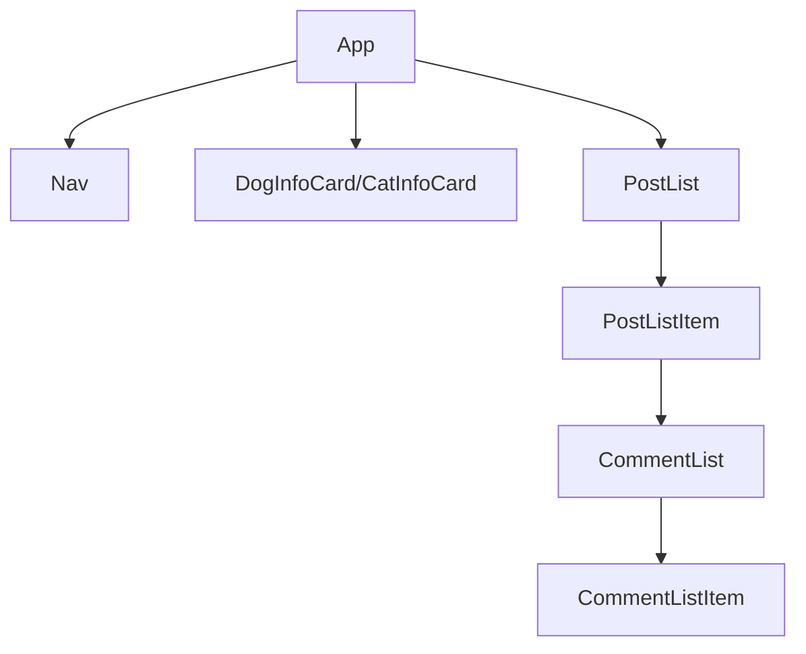

# Fetch
<!-- Github Intro -->
Fetch: Your Ultimate Pet Resources App for Dog and Cat Owners

Introducing Fetch, the comprehensive pet resources app designed exclusively for dog and cat owners. Whether you're a seasoned pet parent or a new addition to the pet-loving community, Fetch is your one-stop destination for all things related to the care, well-being, and happiness of your furry friends.

[Fetch Deployed Site](https://pet-front-end.onrender.com/)

[Backend Repo](https://github.com/gharmon327/pet-server)

#### Technologies Used

##### Backend
- Node
- Express
- MongoDB
- Postman

##### Frontend
- React
- Javascript
- HTML
- CSS
- SASS

#### Component Architecture

#### User Stories
##### Provider Accounts
- AAU, I can sign up, log in, and log out from my account.
- AAU, I can see a list of cat breeds.
- AAU, I can see a list of dog breeds.
- AAU, I can see a specific cat or dog breed.
- AAU, I see resource articles.
- AAU, I can save a resource.
- AAU, I can comment on a resource.
- AAU, I can delete a comment.
- AAU, I can view my saved resources and comments.
